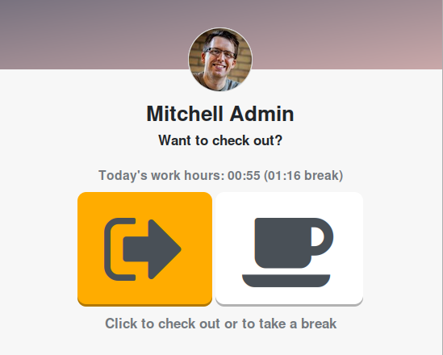

This module lets employees take breaks on the attendance screen:

This allows them to check in at the beginning of the working day, check out at the end and record breaks in between.

To be sure employees take enough breaks, there's also flagging for employees who didn't take enough breaks.
