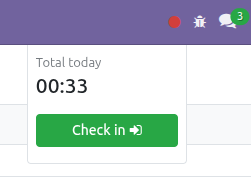
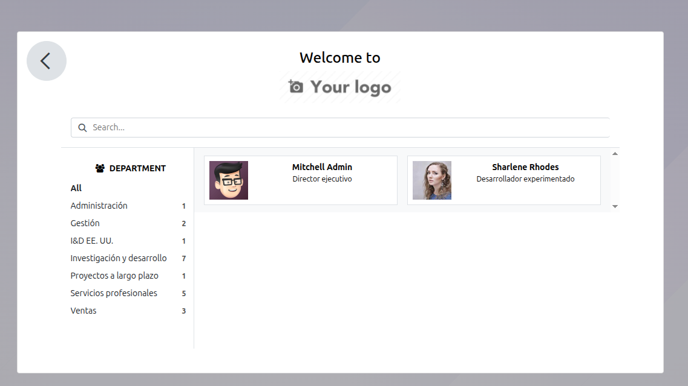
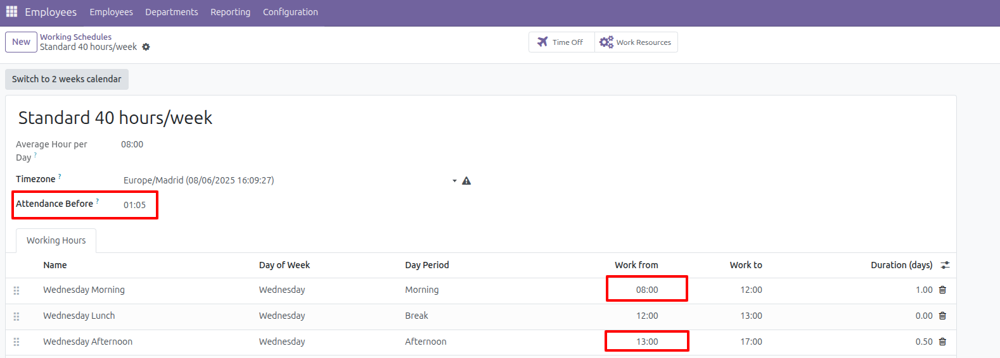

Validate work date according to assigned schedule
---------------

Kiosk Mode:

1. Go to *Attendances* > *Kiosk Mode* or Go to assistance icon marked in the upper right
   corner and then click on the button that appears.
2. Select the way to identify yourself
3. Select the employee
4. When you select an employee or click the button, if the current day or time doesn't match
   their work schedule, a message will be displayed notifying them of this, and they won't
   be able to clock in at that time.
   This validation is taken into account at the entrance.

Allow entry before a certain time
----------------------------
1. Go to *Employees* > *Configuration* > *Working Schedules*
2. Create a new working schedule
3. Define in the *Attendance Before* field a time that allows
   the user to perform attendance before the actual time.
4. Save

Example:
Morning: 8:00 - 12:00
Afternoon: 1:00 - 5:00

Time allowed before: 1:05

This means that the employee can clock in 1 hour and 5 minutes before 08:00 y 13:00

