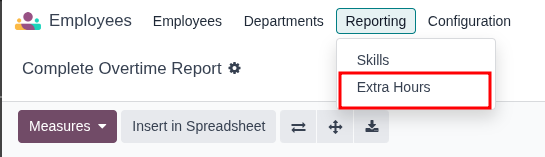

1. Go to **Employees \> Reporting \> Extra Hours**

2. View overtime from all sources.
3. Use filters to distinguish between overtime types
4. Switch between Pivot, List, Calendar, and Graph views for different analyse